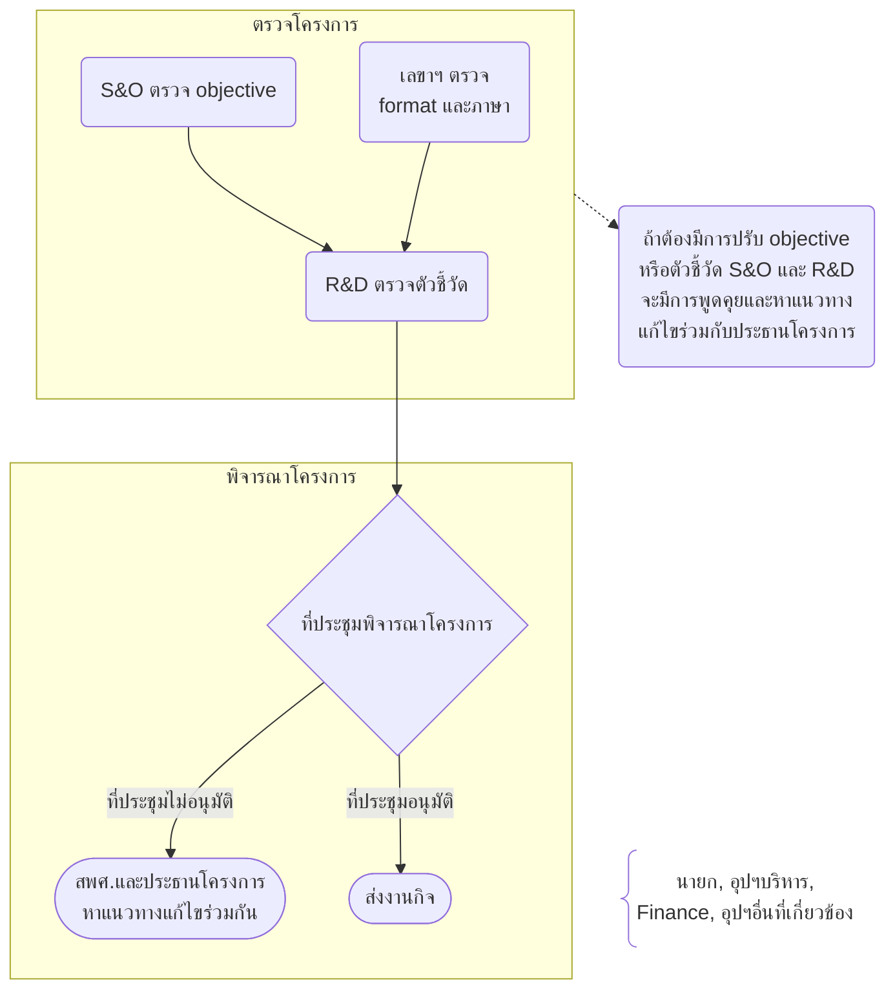

สามารถสร้างแผนภาพโดยใช้ [Mermaid](https://mermaid.js.org/) ซึ่งเป็นเครื่องมือที่ใช้ในการสร้างแผนภาพ แผนผัง หรือ Flow Chart

<CardGroup>
  <Card
    title="Mermaid Live Edit"
    icon="frame"
    href="https://mermaid.live/edit"
  >
    ใช้ preview โค้ด Mermaid ได้แบบเรียลไทม์
  </Card>
  <Card
    title="Mermaid Playground"
    icon="square-pen"
    href="https://www.mermaidchart.com/play"
  >
    ใช้สร้าง Mermaid Diagram โดยไม่ต้องเขียนโค้ด
  </Card>
</CardGroup>

<Tip>สามารถส่งภาพ Diagram ที่ต้องการสร้างมาให้ทีม IT ช่วยสร้างได้</Tip>

หลังได้โค้ดจาก Editor แล้ว ให้นำมาใส่ในหน้าเนื้อหา

<Steps>
  <Step title="เปลี่ยน Web Editor เป็น Markdown Mode">
        
  </Step>
  <Step title="วางโค้ด Mermaid ลงในหน้าเนื้อหา">
    เริ่มด้วย ` ```mermaid` และจบด้วย ` ``` `
    
    สามารถคัดลอกโค้ดด้านล่างไปวาง แล้วคัดลอกโค้ดจาก Editor แล้ววางแทนบรรทัดกลางได้เลย

    ````md
    ```mermaid
    // Your mermaid code block here
    ```
    `````

  </Step>
  <Step title="หลังกลับมา Visual Mode จะเห็นเป็น Code Block ดังรูปด้านล่าง">
    เมื่อ Publish แล้ว จะเห็นในหน้าเนื้อหาจริงเป็นแผนภาพตามโค้ดที่เขียนไว้ ไม่ต้องกังวลว่าจะแสดงเป็นโค้ด
    
  </Step>
</Steps>

## ตัวอย่าง



โค้ดที่เพิ่มในหน้า Markdown Mode

````md

````

```

```
