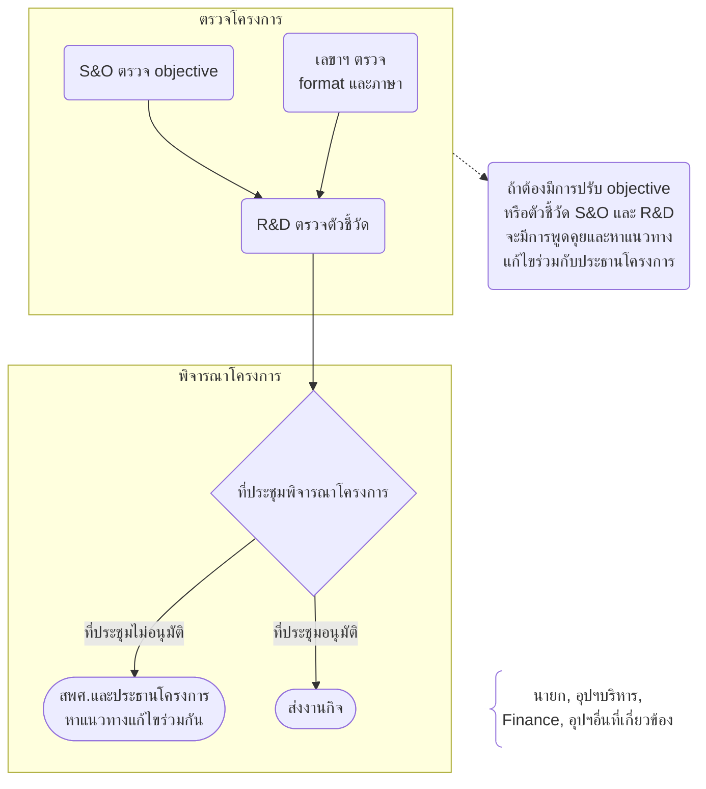

```mermaid
flowchart TB
  subgraph pre[ตรวจโครงการ]
  sec(เลขาฯ ตรวจ
  format และภาษา)
  so(S&O ตรวจ objective)
  rd(R&D ตรวจตัวชี้วัด)
  end
  subgraph committee[พิจารณาโครงการ]
  check{ที่ประชุมพิจารณาโครงการ}
  reject([สพศ.และประธานโครงการ
  หาแนวทางแก้ไขร่วมกัน])
  pass([ส่งงานกิจ])
  end
  prereject(ถ้าต้องมีการปรับ objective
  หรือตัวชี้วัด S&O และ R&D
  จะมีการพูดคุยและหาแนวทาง
  แก้ไขร่วมกับประธานโครงการ)
  member@{ shape: comment, label: "นายก, อุปฯบริหาร,
  Finance, อุปฯอื่นที่เกี่ยวข้อง" }

  sec --> rd
  so --> rd
  rd --> check
  check -- ที่ประชุมไม่อนุมัติ --> reject
  check -- ที่ประชุมอนุมัติ --> pass
  pre -.-> prereject
  committee ~~~ member
```
