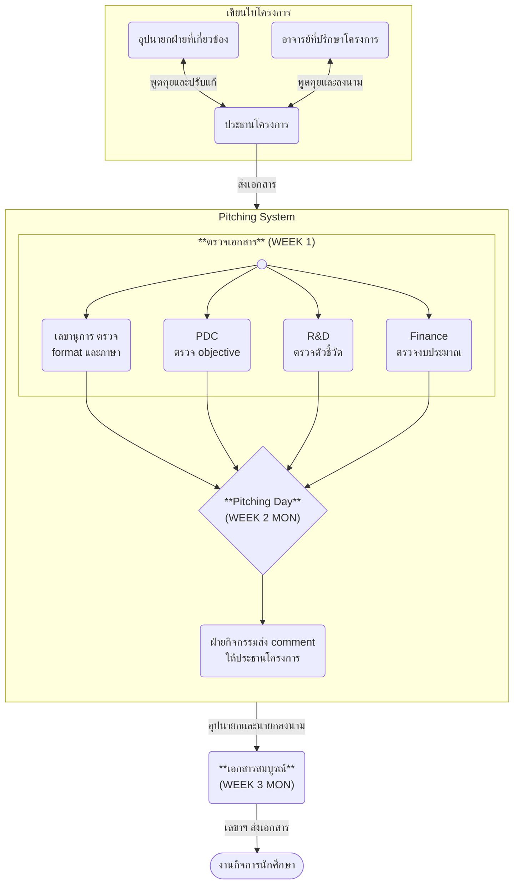
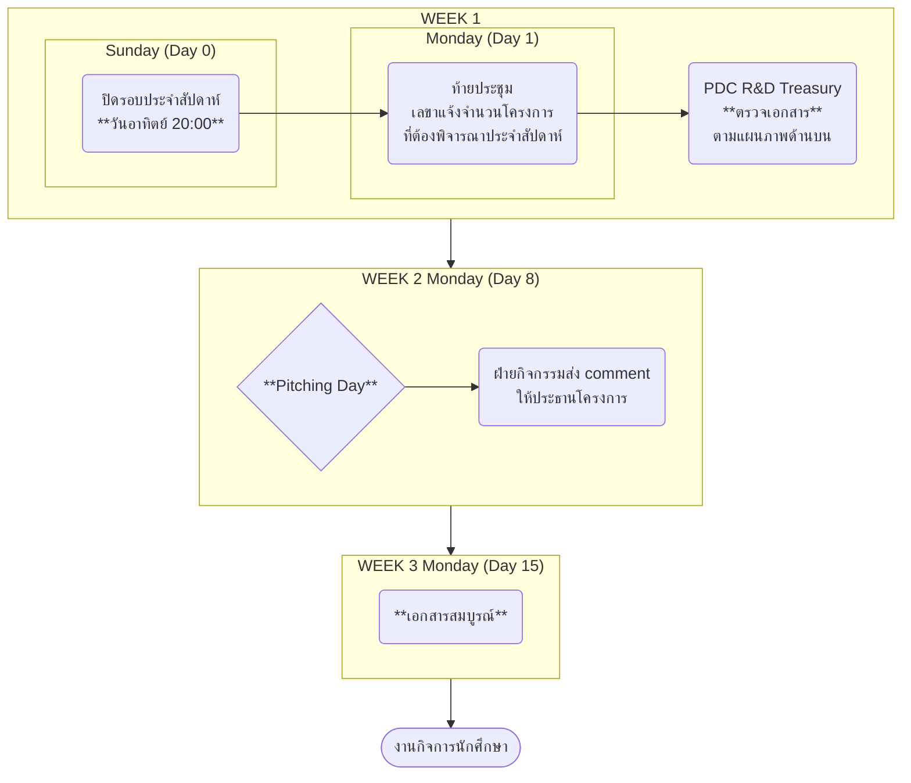

## ขั้นตอนการพิจารณาโครงการ

**Pitching Day** เป็นการให้ประธานโครงการ pitch โครงการกับอุปนายก และฝ่ายที่เกี่ยวข้องจาก สพศ.

```mermaid
flowchart TB
subgraph pre[เขียนใบโครงการ]
  director(ประธานโครงการ)
  oops(อุปนายกฝ่ายที่เกี่ยวข้อง)
  advisor(อาจารย์ที่ปรึกษาโครงการ)
end
subgraph pitch[Pitching System]
direction TB
  subgraph committee["**ตรวจเอกสาร** (WEEK 1)"]
    start@{ shape: sm-circ }
    sec(เลขานุการ ตรวจ
    format และภาษา)
    pdc(PDC
    ตรวจ objective)
    rd(R&D
    ตรวจตัวชี้วัด)
    fin(Finance
    ตรวจงบประมาณ)
  end
  pitchday{"**Pitching Day**
  (WEEK 2 MON)"}
  comment(ฝ่ายกิจกรรมส่ง comment
  ให้ประธานโครงการ)
end
complete("**เอกสารสมบูรณ์**
(WEEK 3 MON)")
sisd([งานกิจการนักศึกษา])

oops <--พูดคุยและปรับแก้--> director
advisor <--พูดคุยและลงนาม--> director
director --ส่งเอกสาร--> pitch
start --> sec & pdc & rd & fin
sec & pdc & rd & fin --> pitchday
pitchday --> comment
pitch --อุปนายกและนายกลงนาม--> complete
complete --เลขาฯ ส่งเอกสาร--> sisd
```

## ระยะเวลาพิจารณาโครงการ

```mermaid
flowchart TB
subgraph wk1[WEEK 1]
  subgraph d0["Sunday (Day 0)"]
    start(ปิดรอบประจำสัปดาห์
    **วันอาทิตย์ 20:00**)
  end
  subgraph d1["Monday (Day 1)"]
    mon1(ท้ายประชุม
    เลขาแจ้งจำนวนโครงการ
    ที่ต้องพิจารณาประจำสัปดาห์)
  end
  review(PDC R&D Treasury
  **ตรวจเอกสาร**
  ตามแผนภาพด้านบน)
end
subgraph d8["WEEK 2 Monday (Day 8)"]
  mon2{**Pitching Day**}
  comment(ฝ่ายกิจกรรมส่ง comment
  ให้ประธานโครงการ)
end
subgraph d15["WEEK 3 Monday (Day 15)"]
  mon3(**เอกสารสมบูรณ์**)
end
sisd([งานกิจการนักศึกษา])

  start --> mon1
  mon1 --> review
  wk1 --> d8
  mon2 --> comment
  d8 --> d15
  d15 --> sisd
```
