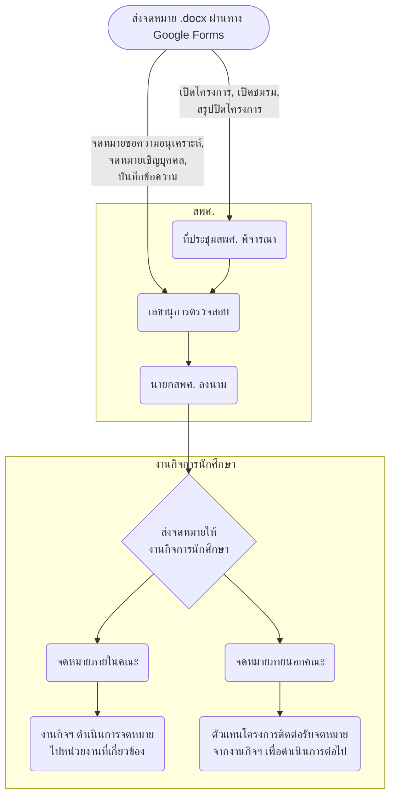

<Card
  title="Google Forms ส่งจดหมาย"
  icon="file-import"
  href="https://docs.google.com/forms/d/e/1FAIpQLSck0bUQAZSNpk1T7kEBabDPs6rqHWzbVkGhbAo37ATRZKRwjw/viewform"
/>
<CardGroup cols={2}>
  <Card
    title="ตัวอย่างการทำจดหมาย"
    icon="file-vector"
    href="https://drive.google.com/drive/folders/1AaHvfmLr0mZG9QTdK6T8QnjNa71BIsHq?usp=sharing"
  />
  <Card
    title="ติดตามสถานะจดหมาย"
    icon="sign-post"
    href="https://docs.google.com/spreadsheets/d/11I4-g_6rDkbSrbnQmtfO7WPsjiyFH-VHaDNAz-XzRrc/edit?usp=sharing"
  >
    ปีวาระ 2568
  </Card>
</CardGroup>

## ข้อกำหนดการส่งจดหมาย

- **‼️ ตัดรอบ<u>จดหมาย</u>ทุกวันเวลา 20.00 น.**
- **‼️ ตัดรอบ<u>ใบเปิดโครงการ</u>ทุกวันอาทิตย์เวลา 20.00 น.**
- กรณียกเลิกจดหมาย ส่งจดหมายฉบับใหม่ พร้อมเลือก “ยกเลิกจดหมายก่อนหน้า”
- จดหมายที่ส่งมาต้องมีลายเซ็นผู้รับผิดชอบโครงการด้วยทุกฉบับ
- จดหมายเปิดโครงการต้องมีลายเซ็นผู้รับผิดชอบและอาจารย์ที่ปรึกษาโครงการ
- หากมีข้อสงสัยเพิ่มเติม ติดต่อได้ที่ เลขานุการ สพศ. ปี 68 Email : [secretary.smsu2025@gmail.com](mailto:secretary.smsu2025@gmail.com)

## Flow การส่งและออกเลขจดหมาย

